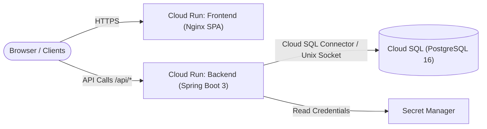

# 🚀 SewNex / QTech Line Balancing Application - GCP Deployment Guide

This guide provides step-by-step instructions for deploying the **SewNex Line Balancing System** (Java 21 Spring Boot + PostgreSQL 16 + React Vite SPA) to **Google Cloud Platform (GCP)** using **Cloud Run** and **Cloud SQL**.

---

## 🏗️ Architecture



---

## 📋 Prerequisites

1. **Google Cloud SDK (`gcloud` CLI)** installed: [Install Guide](https://cloud.google.com/sdk/docs/install)
2. GCP Project with **Owner** or **Editor** permissions.
3. Billing enabled on your GCP project.

---

## ⚡ Option 1: Automated 1-Click Deployment (Recommended)

Run the automated deployment script from the project root. It will enable APIs, create the PostgreSQL database, build the container images, and deploy both frontend and backend to Cloud Run.

### On Windows (PowerShell):
```powershell
# 1. Login and select your project
gcloud auth login
gcloud config set project YOUR_PROJECT_ID

# 2. Run the deployment script
.\scripts\deploy-gcp.ps1 -Region "asia-south1"
```

### On Linux / Mac / Cloud Shell (Bash):
```bash
# 1. Login and select your project
gcloud auth login
gcloud config set project YOUR_PROJECT_ID

# 2. Make script executable and run
chmod +x ./scripts/deploy-gcp.sh
./scripts/deploy-gcp.sh
```

---

## 🛠️ Option 2: Manual Step-by-Step Deployment

### Step 1: Enable Required GCP APIs
```bash
gcloud services enable \
    run.googleapis.com \
    sqladmin.googleapis.com \
    artifactregistry.googleapis.com \
    secretmanager.googleapis.com \
    cloudbuild.googleapis.com
```

### Step 2: Create Artifact Registry Repository
```bash
gcloud artifacts repositories create sewnex-app-repo \
    --repository-format=docker \
    --location=asia-south1 \
    --description="Docker repository for SewNex Application"
```

### Step 3: Create Cloud SQL PostgreSQL Database
```bash
# 1. Create PostgreSQL 16 instance (takes ~4-5 mins)
gcloud sql instances create sewnex-postgres-db \
    --database-version=POSTGRES_16 \
    --tier=db-g1-small \
    --region=asia-south1 \
    --root-password="YOUR_STRONG_PASSWORD" \
    --storage-auto-increase

# 2. Create the application database
gcloud sql databases create qtech_linebalancing --instance=sewnex-postgres-db

# 3. Store the DB password in Secret Manager
echo -n "YOUR_STRONG_PASSWORD" | gcloud secrets create sewnex-db-password --data-file=-
```

### Step 4: Build & Deploy Backend API (Cloud Run)
```bash
# 1. Get Cloud SQL connection name
CONNECTION_NAME=$(gcloud sql instances describe sewnex-postgres-db --format="value(connectionName)")

# 2. Build backend Docker image
gcloud builds submit ./backend \
    --tag asia-south1-docker.pkg.dev/YOUR_PROJECT_ID/sewnex-app-repo/backend:latest

# 3. Deploy to Cloud Run
gcloud run deploy sewnex-backend \
    --image=asia-south1-docker.pkg.dev/YOUR_PROJECT_ID/sewnex-app-repo/backend:latest \
    --platform=managed \
    --region=asia-south1 \
    --allow-unauthenticated \
    --port=8085 \
    --memory=1Gi \
    --cpu=1 \
    --add-cloudsql-instances=$CONNECTION_NAME \
    --set-env-vars="SPRING_PROFILES_ACTIVE=prod,SPRING_DATASOURCE_URL=jdbc:postgresql:///${DB_NAME}?cloudSqlInstance=${CONNECTION_NAME}&socketFactory=com.google.cloud.sql.postgres.SocketFactory,SPRING_DATASOURCE_USERNAME=postgres,CORS_ALLOWED_ORIGINS=*" \
    --set-secrets="SPRING_DATASOURCE_PASSWORD=sewnex-db-password:latest"
```

### Step 5: Build & Deploy Frontend (Cloud Run)
```bash
# 1. Get the deployed backend URL
BACKEND_URL=$(gcloud run services describe sewnex-backend --platform=managed --region=asia-south1 --format="value(status.url)")

# 2. Build frontend Docker image
gcloud builds submit ./frontend \
    --tag asia-south1-docker.pkg.dev/YOUR_PROJECT_ID/sewnex-app-repo/frontend:latest

# 3. Deploy to Cloud Run
gcloud run deploy sewnex-frontend \
    --image=asia-south1-docker.pkg.dev/YOUR_PROJECT_ID/sewnex-app-repo/frontend:latest \
    --platform=managed \
    --region=asia-south1 \
    --allow-unauthenticated \
    --port=80 \
    --memory=512Mi \
    --cpu=1
```

---

## 🧪 Local Full-Stack Testing with Docker Compose

Before pushing to GCP, you can test the entire containerized stack locally:

```bash
# Start PostgreSQL, Backend, and Frontend containers
docker compose up --build

# Open frontend in your browser:
http://localhost:3000

# Backend API & Actuator Health:
http://localhost:8085/actuator/health
```

---

## 🔍 Useful Verification & Monitoring Commands

- **Check Cloud Run Backend Logs:**
  ```bash
  gcloud logging read "resource.type=cloud_run_revision AND resource.labels.service_name=sewnex-backend" --limit 50
  ```
- **Check Flyway Database Migration Status:**
  ```bash
  curl https://<BACKEND_URL>/actuator/health
  ```
- **Restart Backend Service:**
  ```bash
  gcloud run services update sewnex-backend --region=asia-south1 --force-update
  ```
